# 🚗Vehicle Dealership System

🚗 The Vehicle Dealership System is a Java application that manages vehicle inventory and sales contracts for a dealership.

## Introduction

The Vehicle Dealership System is designed to streamline the process of managing vehicle inventory and sales contracts for a dealership. It provides functionality to create, retrieve, update, and delete vehicle records, as well as manage sales contracts and lease contracts.

Admins are responsible for managing the contracts where as the general employees are responsible for managing the vehicles.d

The system includes the following components:

- 📦 `org.yearup.data` package: Contains data access interfaces and implementations for interacting with the database.
- 📦 `org.yearup.models` package: Contains model classes representing vehicles, sales contracts, lease contracts, and dealerships.
- 📦 `org.yearup.services` package: Contains service classes that implement business logic for managing vehicles and contracts.

## Features

- 🚗Vehicle management:

  - Get vehicle by VIN
  - Get vehicles by dealership ID
  - Get vehicles by price range
  - Get vehicles by make and model
  - Get vehicles by year range
  - Get vehicles by color
  - Get vehicles by mileage range
  - Get vehicles by type
  - Create a new vehicle
  - Delete a vehicle

- 📃Sales contract management:

  - Get contract by ID
  - Get all contracts
  - Make a purchase (create a new sales contract)
  - Remove a contract

- 📃Lease contract management:
  - Get contract by ID (not implemented yet)
  - Get all contracts (not implemented yet)
  - Create a new lease contract (not implemented yet)
  - Remove a contract (not implemented yet)

## Requirements

- Java 17 or above ☕️
- MySQL database 🗄️

### DB Schema

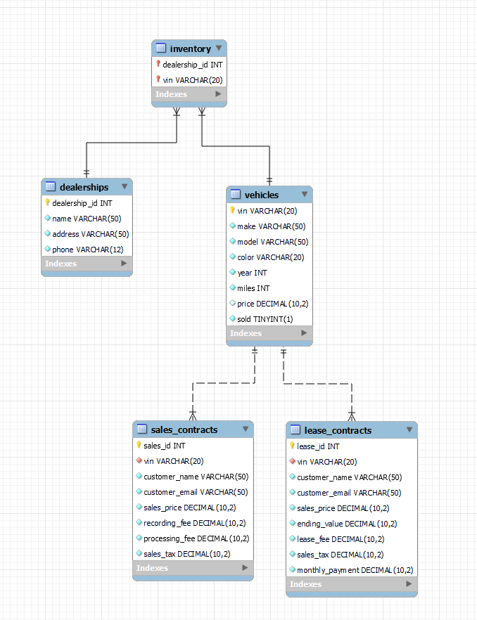

## Screenshots

### Home page

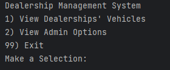

### Dealership UI

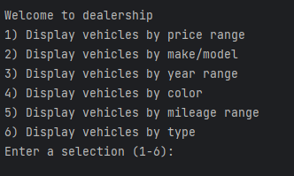

### Admin UI

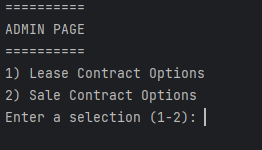

### Get Vehicle By Price

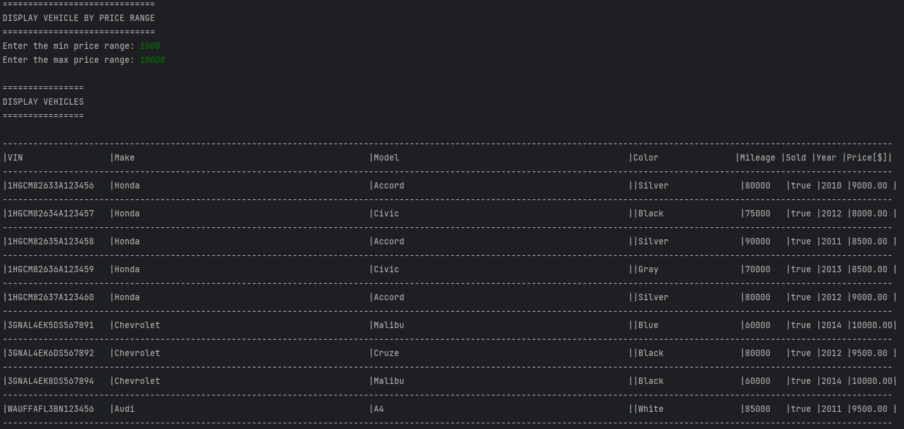

### Get Vehicle By Color

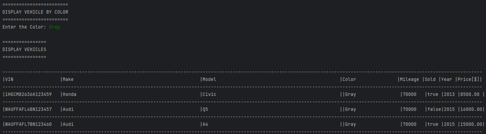

### Get Vehicle By Mileage

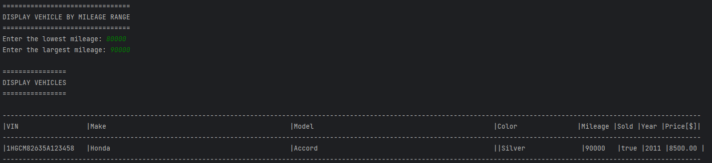

### Get Vehicle By Year

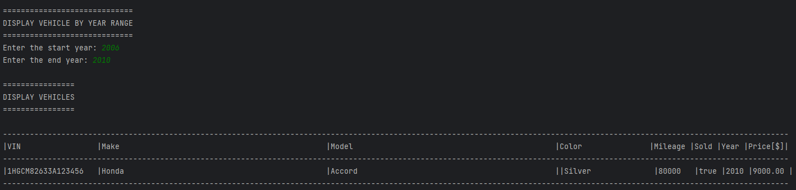

### Get Vehicle By Make (Model)

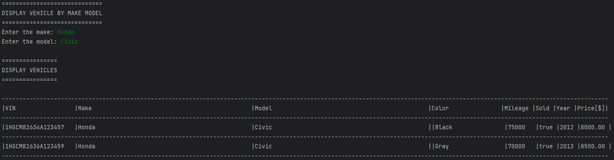

### Create Sales Contract

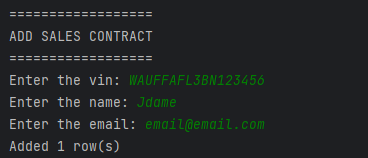

### Remove Sales Contract

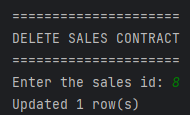

### List All Sales Contract

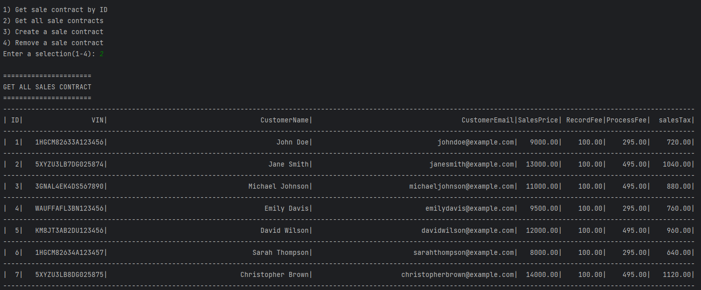

### Sales Contract By ID

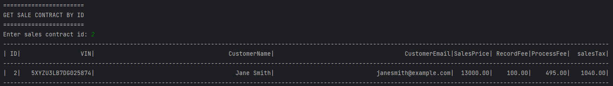

### Create Lease Contract

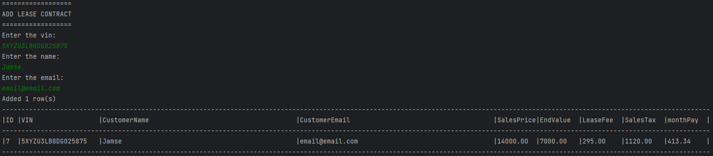

### Remove Lease Contract

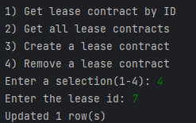

### List All Lease Contract

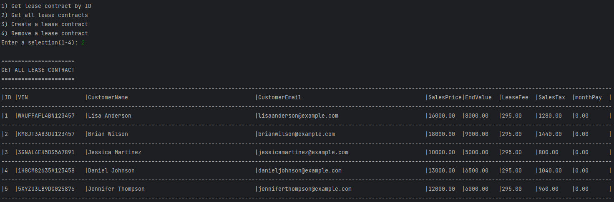

### Lease Contract By ID

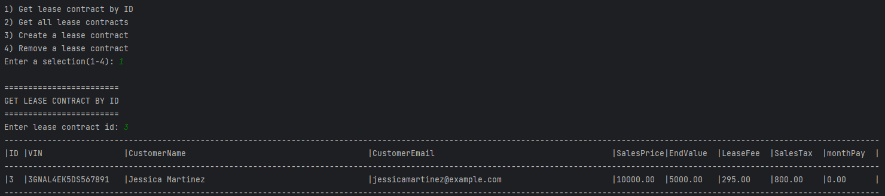
